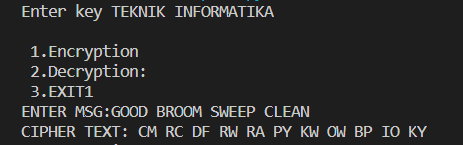
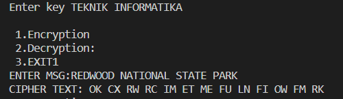
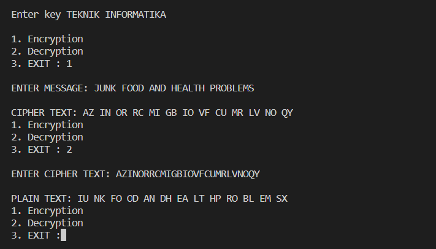

# PERTEMUAN 6
### NAMA: DIYAN ARUM MAHESWARI 
### KELAS: TI. 20. A. 1
### NIM: 312010133

_____________________________________________________________________

### Lakukan Enkripsi Playfair Chiper dengan kalimat berikut

     'GOOD BROOM SWEEP CLEAN'

     'REDWOOD NATIONAL STATE PARK'

     'JUNK FOOD AND HEALTH PROBLEMS'

Dan menggunakan kunci "TEKNIK INFORMATIKA"

Jawab: 

Untuk dapat menghasilkan hasil outputnya, silahkan masukan kata kuncinya terlebih dahulu pada kolom 'Enter key'.

Kemudian pilihlah menu Encryption pada menu pertama, dan input'lah angka 1 disamping EXIT untuk dapat melanjutkannya.

Setelahnya silahkan masukan message atau pesan yang ingin dirubah. Jika sudah tekan Enter, maka munculah cipher text hasil dari encryption pesan tadi.

Berikut hasil dari Encryption yang sudah saya lakukan.

    

# 
 THANK'S FOR YOUR ATTENTION!! SEE YOU!!