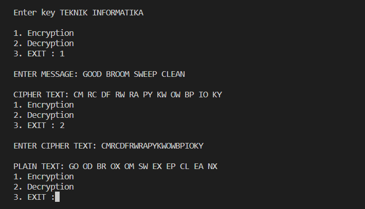

# PERTEMUAN 6
### NAMA: DIYAN ARUM MAHESWARI 
### KELAS: TI. 20. A. 1
### NIM: 312010133

_____________________________________________________________________

### Lakukan Enkripsi Playfair Chiper dengan kalimat berikut

     'GOOD BROOM SWEEP CLEAN'

     'REDWOOD NATIONAL STATE PARK'

     'JUNK FOOD AND HEALTH PROBLEMS'

Dan menggunakan kunci "TEKNIK INFORMATIKA"

Jawab: 

    

# 
 THANK'S FOR YOUR ATTENTION!! SEE YOU!!